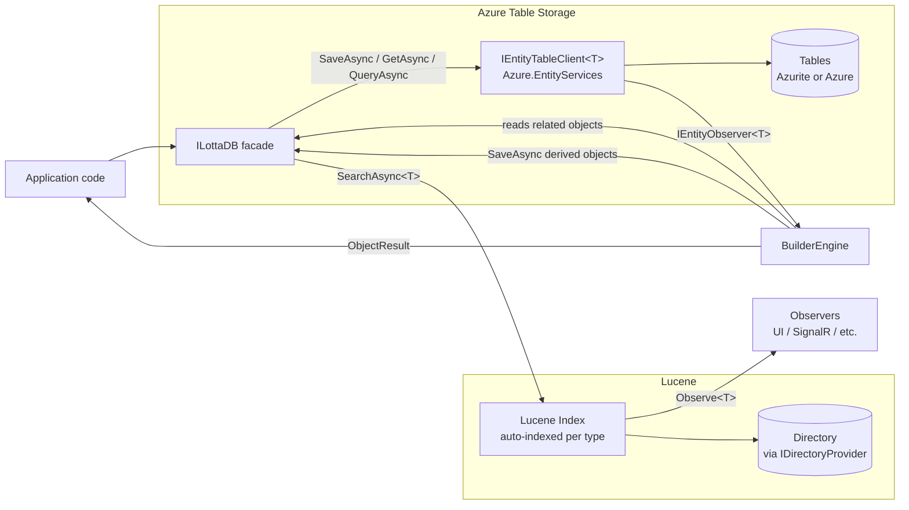
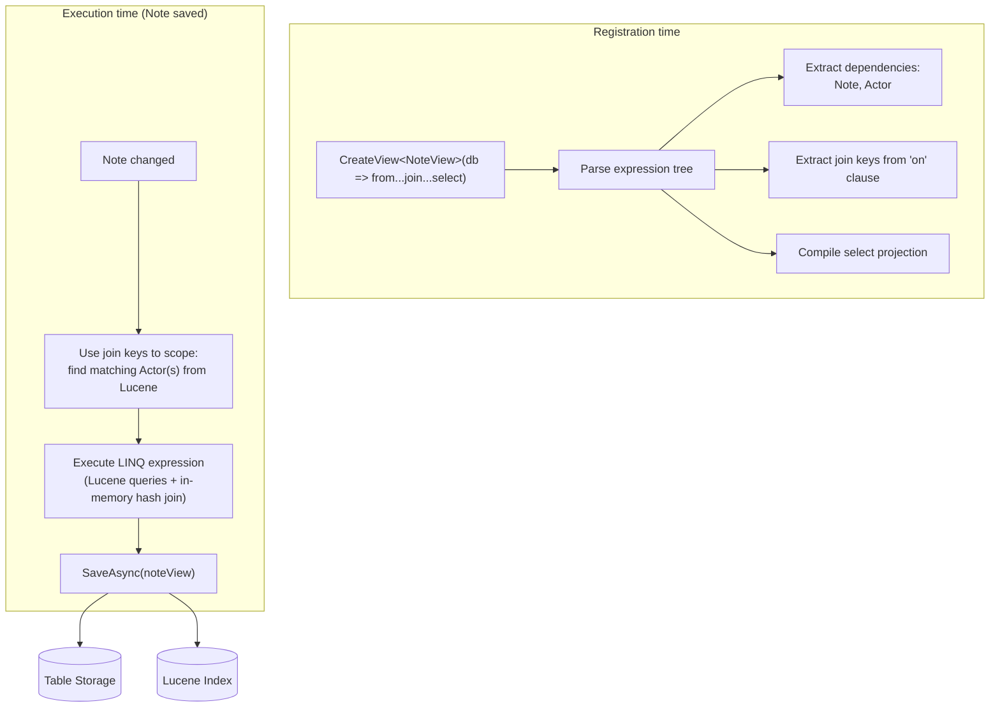

# LottaDB Architecture

## Overview

LottaDB is a .NET library that stores **POCOs in Azure Table Storage** and automatically indexes them into **Lucene** for rich queries. Materialized views are declared as **LINQ join expressions** via `CreateView<T>()` — LottaDB parses the expression tree, extracts dependencies and join keys, and incrementally maintains the derived objects as source data changes. Everything is an object; derived objects are stored and indexed like any other, enabling cascading views.

There is no distinction between "entities" and "views." **Everything is an object.** Some objects are written by application code, some are produced by builders. All objects live in Azure Table Storage and are automatically indexed into Lucene.

LottaDB is **unopinionated about data semantics**. Whether you use it for mutable objects (upsert by natural key), time-ordered immutable records (append with time-based keys), or a mix — that's your choice, expressed through the per-type mapping. LottaDB just stores what you give it and runs the builders.

`Store<T>()` (modeled after [`Azure.EntityServices.Tables`](https://github.com/Aguafrommars/Azure.EntityServices)) defines how each type is persisted and indexed — partition keys, row keys, tags (table storage), and field mappings (Lucene) — all in one place. The full POCO is always stored as JSON.

Storage backend: **Azure Table Storage**, accessed via `Azure.Data.Tables` + `Azure.EntityServices.Tables`. Local development and tests run against **[Azurite](https://github.com/Azure/Azurite)** — same wire protocol, same SDK, no separate in-memory provider.

### Design goals

1. **Store POCOs in Azure Table Storage** with a clean mapping — no `ITableEntity`, no infrastructure on the domain model.
2. **Auto-index everything into Lucene** — every object is searchable out of the box.
3. **Materialized views as LINQ joins** — `CreateView<T>()` declares the join; LottaDB incrementally maintains the result.
4. **Query with async LINQ** — `SearchAsync<T>()` for Lucene, `QueryAsync<T>()` for table storage.
5. **Rebuildable**: any Lucene index can be rebuilt from table storage.

## High-Level Components



## Core Concepts

### Everything is an object

Objects in LottaDB are ordinary classes. They do **not** implement `ITableEntity`, do **not** inherit a base class, and do **not** carry `PartitionKey` / `RowKey` / `ETag` / `Timestamp` properties.

```csharp
public class Actor
{
    public string Domain       { get; set; }
    public string Username     { get; set; }
    public string DisplayName  { get; set; }
    public string AvatarUrl    { get; set; }
}

public class Note
{
    public string NoteId     { get; set; }
    public string AuthorId   { get; set; }
    public string Domain     { get; set; }
    public string Content    { get; set; }
    public DateTimeOffset Published { get; set; }
    public List<string> Tags { get; set; }
}

// A derived object — produced by a builder, stored and indexed like any other object
public class NoteView
{
    [PartitionKey] public string Domain    { get; set; }
    [RowKey]       public string NoteId    { get; set; }
    public string AuthorUsername  { get; set; }
    public string AuthorDisplay   { get; set; }
    public string AvatarUrl       { get; set; }
    public string Content         { get; set; }
    public DateTimeOffset Published { get; set; }
    public string[] Tags          { get; set; }
}
```

All three are objects. `Actor` and `Note` are written by application code. `NoteView` is produced by a `CreateView` when a `Note` or `Actor` is saved. All three need `Store<T>()` registration (with or without a lambda) and all three are stored in Azure Table Storage and auto-indexed into Lucene.

### Store&lt;T&gt; — storage and indexing in one place

`Store<T>()` defines everything about how a type is persisted (Azure Table Storage) and indexed (Lucene). Both table storage config and Lucene index config can be specified via **attributes on the POCO** or **fluently** in `Store<T>()`. Convention defaults handle the rest.

Each registered object type gets **its own Azure table** (one table per CLR type) and **its own Lucene index**.

#### Attribute-based (zero fluent config)

Decorate the POCO with table storage and Lucene attributes — `Store<T>()` needs no lambda:

```csharp
public class Actor
{
    [PartitionKey]
    public string Domain       { get; set; }

    [RowKey]
    public string Username     { get; set; }

    [Field(IndexMode.NotAnalyzed)]
    public string DisplayName  { get; set; }

    public string AvatarUrl    { get; set; }
}

public class Note
{
    [PartitionKey]
    public string Domain       { get; set; }

    [RowKey(Strategy = RowKeyStrategy.DescendingTime)]
    public DateTimeOffset Published { get; set; }

    [Tag] public string AuthorId   { get; set; }

    [Field(Key = true)]
    public string NoteId       { get; set; }

    [Field(Analyzer = typeof(EnglishAnalyzer))]
    public string Content      { get; set; }

    [NumericField(DocValues = true)]
    public DateTimeOffset Published { get; set; }

    public List<string> Tags   { get; set; }    // multi-valued, auto-handled

    [IgnoreField]
    public string InternalState { get; set; }   // not indexed
}

// Registration — everything inferred from attributes
opts.Store<Actor>();
opts.Store<Note>();
```

Table storage attributes: `[PartitionKey]`, `[RowKey]`, `[Tag]`, `[ComputedTag]`.
Lucene attributes (from `Iciclecreek.Lucene.Net.Linq`): `[Field]`, `[NumericField]`, `[IgnoreField]`, `[DocumentKey]`.

#### Fluent (for types you can't or don't want to attribute)

```csharp
opts.Store<Note>(s =>
{
    // --- Table storage ---
    s.SetPartitionKey(n => n.Domain);
    s.SetRowKey(RowKeyStrategy.DescendingTime(n => n.Published));
    s.AddTag(n => n.AuthorId);
    s.AddTag(n => n.Published);
    s.AddComputedTag("Year", n => n.Published.Year);

    // --- Lucene index ---
    s.Index(n => n.NoteId).AsKey();
    s.Index(n => n.AuthorId).NotAnalyzed();
    s.Index(n => n.Content).AnalyzedWith<EnglishAnalyzer>();
    s.Index(n => n.Published).AsNumeric().WithDocValues();
    s.Index(n => n.Tags);
    s.Ignore(n => n.InternalState);
});
```

You can also pass a `ClassMap<T>` for the Lucene side if you prefer that style:

```csharp
opts.Store<Note>(s =>
{
    s.SetPartitionKey(n => n.Domain);
    s.SetRowKey(RowKeyStrategy.DescendingTime(n => n.Published));
    s.SetLuceneMap(new NoteMap());   // ClassMap<Note> from Iciclecreek.Lucene.Net.Linq
});
```

#### Convention defaults

Anything not explicitly configured gets sensible defaults:
- **Table name** — lowercased CLR type name (`Note` → `notes`)
- **Lucene fields** — all public properties indexed, analyzed, stored
- **Tags** — none by default (opt-in via `[Tag]` or `s.AddTag(...)`)

#### Mix and match

Attributes and fluent config combine freely. Attributes set the base; fluent overrides them. This lets you attribute the POCO for the common case and use `Store<T>()` for environment-specific tweaks.

The table storage side (partition key, row key, tags) defines what's server-side filterable via `QueryAsync<T>()`. The Lucene side defines what's searchable via `SearchAsync<T>()`. Both live together because they're both storage metadata for the same type — separate from materialized view logic (`CreateView`).

#### Row key strategies

| Strategy | RowKey | Behavior | Use case |
|----------|--------|----------|----------|
| `o => o.OrderId` (natural key) | `order-42` | **Upsert** — one row per object, latest state | Mutable objects (users, profiles) |
| `RowKeyStrategy.DescendingTime(o => o.Published)` | `0250479199999_01HW...` | **Insert** — new row every write, newest first | Time-ordered records (activities, posts) |
| `RowKeyStrategy.AscendingTime(o => o.Published)` | `0638792800000_01HW...` | **Insert** — new row every write, oldest first | Logs, audit trails |
| Custom `Func<T,string>` | anything | Whatever you need | Composite keys, domain-specific ordering |

`SaveAsync` is always an **upsert** (insert-or-replace) at the Azure Table Storage level. For natural-key objects this overwrites the existing row. For time-keyed objects every write has a unique RowKey, so the upsert is effectively an insert.

#### What a row looks like

| Column         | Value                                                               |
|----------------|---------------------------------------------------------------------|
| PartitionKey   | `example.com`                                                       |
| RowKey         | `0250479199999_01HW...` *(or natural key)*                          |
| Timestamp      | server-assigned                                                     |
| ETag           | server-assigned                                                     |
| `_json`        | `{"noteId":"...","authorId":"...","content":"...", ...}`            |
| AuthorId       | `alice`        *(tag)*                                              |
| Published      | `2026-04-10T...` *(tag)*                                           |
| Year           | `2026`         *(computed tag)*                                     |

The full POCO graph is preserved losslessly in `_json`. Tags exist purely as a write-side index for cheap server-side filtering; on read, the POCO is always rehydrated from `_json`.

**Every stored object is automatically indexed into Lucene.** `SearchAsync<Note>()` works out of the box.

### ILottaDB facade

Storage is handled by [`Azure.EntityServices.Tables`](https://github.com/Aguafrommars/Azure.EntityServices) via `IEntityTableClient<T>`. For each type registered with `Store<T>()`, an `IEntityTableClient<T>` and a Lucene index are created and cached internally.

What LottaDB owns is a thin **`ILottaDB`** facade whose job is to:

1. Own the per-type `IEntityTableClient<T>` instances and Lucene indexes.
2. **Auto-index every object into Lucene on save.**
3. **Run builders after every write**, which may produce additional objects (stored and indexed the same way).
4. **Detect cycles** in builder chains to prevent infinite loops.

```csharp
public interface ILottaDB
{
    // === Write ===

    // Save: upsert (clobbers ETag), auto-index into Lucene, run builders
    Task<ObjectResult> SaveAsync<T>(T entity, CancellationToken ct = default);
    Task<ObjectResult> SaveAsync<T>(string partitionKey, string rowKey, T entity, CancellationToken ct = default);

    // Change: optimistic concurrency — fetch, mutate, save-with-ETag, retry on conflict
    Task<ObjectResult> ChangeAsync<T>(string partitionKey, string rowKey,
        Func<T, T> mutate, CancellationToken ct = default);
    Task<ObjectResult> ChangeAsync<T>(T entity,
        Func<T, T> mutate, CancellationToken ct = default);

    // Delete: remove from table storage and Lucene, run builders
    Task<ObjectResult> DeleteAsync<T>(string partitionKey, string rowKey, CancellationToken ct = default);
    Task<ObjectResult> DeleteAsync<T>(T entity, CancellationToken ct = default);

    // === Read (table storage) ===

    // Point-read by key (always fetches)
    Task<T?> GetAsync<T>(string partitionKey, string rowKey, CancellationToken ct = default);
    // Conditional get: returns null if ETag unchanged; force: true to always fetch
    Task<T?> GetAsync<T>(T entity, bool force = false, CancellationToken ct = default);

    // Async LINQ against table storage (tag predicates push down to OData)
    IAsyncQueryable<T> QueryAsync<T>();

    // === Read (Lucene) ===

    // Async LINQ against Lucene (full-text search, rich queries)
    IAsyncQueryable<T> SearchAsync<T>();

    // === Observe ===

    // Subscribe to changes for any object type (user-written or builder-produced)
    IDisposable Observe<T>(Func<ObjectChange<T>, Task> handler);

    // === Maintain ===

    // Rebuild the Lucene index for a type from table storage
    Task RebuildIndex<T>(CancellationToken ct = default);

    // === Escape hatch ===

    // Raw Azure.EntityServices client (bypasses builders and indexing)
    IEntityTableClient<T> Table<T>();
}
```

#### Concurrency model

LottaDB offers two write strategies:

- **`SaveAsync`** — unconditional upsert. Clobbers the existing row regardless of ETag. Fast path for new objects, time-keyed appends, and fire-and-forget writes.
- **`ChangeAsync`** — optimistic concurrency. Fetches the current object, calls your mutation function, saves with the ETag. If the ETag has changed (another writer got there first), it re-fetches and re-applies your function until it succeeds. Max retries are configurable to prevent infinite loops.

`ChangeAsync` is the safe path for read-modify-write on natural-key objects. The mutation function should be **pure** (no side effects) since it may be called multiple times on retry.

#### ETag tracking

LottaDB tracks ETags **internally** — keyed by type + partition key + row key. POCOs never carry ETags; they stay plain objects. ETags are captured on every read (`GetAsync`, `QueryAsync`) and write (`SaveAsync`, `ChangeAsync`), and used by `ChangeAsync` for optimistic concurrency.

`GetAsync(existingObject)` uses the internally-tracked ETag to do a **conditional get** (HTTP If-None-Match). If the object hasn't changed, it returns `null` (your copy is current). If it has changed, it returns the fresh object. Use `force: true` to bypass the check and always fetch.

```csharp
var actor = await lottaDb.GetAsync<Actor>("example.com", "alice");  // always fetches

// Later: check if my copy is still current
var updated = await lottaDb.GetAsync(actor);              // null = unchanged
var updated = await lottaDb.GetAsync(actor, force: true); // always fetches
```

#### Error handling in builders

When a builder or `CreateView` evaluation fails during a `SaveAsync`/`ChangeAsync`/`DeleteAsync`:

1. **The source object's save always succeeds.** The object is in table storage and indexed in Lucene. This is never rolled back.
2. **Builder failures are captured, not thrown.** Errors are collected into `ObjectResult.Errors` — the caller can inspect them or ignore them.
3. **Failed builders are reported to an `IBuilderFailureSink`** (configurable) for retry, alerting, or logging.
4. **Derived objects may be stale** until the builder succeeds on retry or the view is rebuilt.

This is an **eventually-consistent** model for derived objects. The source of truth (table storage) is always correct; derived objects catch up.

```csharp
var result = await lottaDb.SaveAsync(note);

if (result.Errors.Any())
{
    // Some builders failed — derived objects may be stale
    foreach (var error in result.Errors)
        logger.LogWarning("Builder failed: {Builder} — {Error}", error.BuilderName, error.Exception);
}
```

#### Method signatures

All write and read-by-key methods have **dual signatures**: one that takes the object (keys extracted from `[PartitionKey]`/`[RowKey]` attributes), and one that takes explicit partition key + row key:

```csharp
// SaveAsync — keys from attributes, or explicit
await lottaDb.SaveAsync(actor);
await lottaDb.SaveAsync<Actor>("example.com", "alice", actor);

// ChangeAsync — read-modify-write with optimistic concurrency
await lottaDb.ChangeAsync<Actor>("example.com", "alice", actor =>
{
    actor.DisplayName = "Alice B.";
    return actor;
});
await lottaDb.ChangeAsync(existingActor, actor =>
{
    actor.DisplayName = "Alice B.";
    return actor;
});

// GetAsync — point-read from table storage
var actor = await lottaDb.GetAsync<Actor>("example.com", "alice");

// DeleteAsync — keys from attributes, or explicit
await lottaDb.DeleteAsync<Actor>("example.com", "alice");
await lottaDb.DeleteAsync(existingActor);

// QueryAsync — LINQ against table storage (tag-filtered)
var notes = await lottaDb.QueryAsync<Note>()
    .Where(n => n.Domain == "example.com" && n.AuthorId == "alice")
    .OrderByDescending(n => n.Published)
    .Take(20)
    .ToListAsync();

// SearchAsync — LINQ against Lucene (full-text, rich queries)
var results = await lottaDb.SearchAsync<NoteView>()
    .Where(v => v.Tags.Contains("csharp") && v.Published > cutoff)
    .OrderByDescending(v => v.Published)
    .Take(20)
    .ToListAsync();

// Stream from Lucene
await foreach (var view in lottaDb.SearchAsync<NoteView>()
    .Where(v => v.AuthorUsername == "alice"))
{
    Process(view);
}

// Observe changes to any type
var subscription = lottaDb.Observe<NoteView>(async change =>
{
    await hub.Clients.All.SendAsync("noteChanged", change);
});
```

All write operations (`SaveAsync`, `ChangeAsync`, `DeleteAsync`) return an `ObjectResult` containing all the objects that were created, updated, or deleted — both the original object and any derived objects produced by builders.

`QueryAsync<T>()` and `SearchAsync<T>()` both return `IAsyncQueryable<T>` (from `System.Linq.Async`). For `QueryAsync<T>()`, predicates against **tagged** properties are translated to server-side OData filters; non-tagged predicates evaluate client-side. For `SearchAsync<T>()`, `Iciclecreek.Lucene.Net.Linq` provides the underlying sync `IQueryable<T>` — LottaDB wraps it in `IAsyncQueryable<T>` at the API boundary. Lucene.Net is in-process memory-mapped I/O with no network calls, so there's no benefit to async internally; the async wrapper keeps LottaDB's API consistent without pretending Lucene has await points.

**Ad-hoc joins at query time** work naturally via standard LINQ — no custom query provider needed:

```csharp
var results = await (
    from note in lottaDb.SearchAsync<Note>().Where(n => n.Domain == "example.com")
    join actor in lottaDb.SearchAsync<Actor>()
        on note.AuthorId equals actor.Username
    select new { note.NoteId, note.Content, actor.DisplayName }
).ToListAsync();
```

Since Lucene is in-process, this executes as a **client-side hash join** — each side queries its Lucene index independently, then LINQ joins the results in memory. O(N+M), not O(N*M). Perfectly reasonable for ad-hoc queries with moderate result sets. For hot paths with large result sets, use `CreateView` to pre-materialize the join instead.

**Local development and tests use [Azurite](https://github.com/Azure/Azurite)**. The test connection string is `UseDevelopmentStorage=true`; tests exercise the same code path as production.

```csharp
services.AddLottaDB(opts =>
{
    opts.UseAzureTables("UseDevelopmentStorage=true");   // Azurite for dev/test
    // or: opts.UseAzureTables(productionConnectionString);
});
```

### Materialized Views via CreateView (LINQ joins)

The primary way to create derived objects is `CreateView<T>()` — a **declarative LINQ join** that LottaDB maintains incrementally. You express the join once; LottaDB infers the dependencies, triggers, and rebuild logic automatically.

```csharp
opts.CreateView<NoteView>(db =>
    from note in db.SearchAsync<Note>()
    join actor in db.SearchAsync<Actor>()
        on new { note.Domain, note.AuthorId } equals new { actor.Domain, Username = actor.Username }
    select new NoteView
    {
        NoteId         = note.NoteId,
        AuthorUsername = actor.Username,
        AuthorDisplay  = actor.DisplayName,
        AvatarUrl      = actor.AvatarUrl,
        Content        = note.Content,
        Published      = note.Published,
        Tags           = note.Tags.ToArray(),
    }
);
```

That single declaration replaces what would otherwise be two builder classes, a mapping, and two builder registrations.

#### Registration vs. execution

At **registration time**, LottaDB parses the expression tree to extract:

| Inferred from expression | What LottaDB extracts |
|---|---|
| `from note in db.SearchAsync<Note>()` | NoteView **depends on** Note |
| `join actor in db.SearchAsync<Actor>()` | NoteView **depends on** Actor |
| `on new { note.Domain, note.AuthorId } equals new { actor.Domain, Username = actor.Username }` | **Join keys** — used to scope which views need rebuilding when a source changes |
| `select new NoteView { ... }` | **Output mapping** — the compiled projection |

At **execution time** (when a source object changes), the engine doesn't need a custom query provider or join implementation. It **just executes the LINQ expression** — `Iciclecreek.Lucene.Net.Linq` handles each side's Lucene query, and standard LINQ does the in-memory hash join. This is the same mechanism as ad-hoc joins on `SearchAsync`, but scoped to the affected rows:

1. Note saved → use join keys to query just the matching Actor(s) from Lucene
2. Execute the LINQ join + select in memory
3. `SaveAsync` the resulting NoteView(s)

The only custom work is **walking the expression tree at registration time** to extract the `on` clause keys — not implementing a query provider.



When an `Actor` is saved, the engine works the other direction — uses join keys to find affected Notes, re-executes the join for each, saves updated NoteViews. Deletes propagate the same way — source object deleted → derived NoteViews auto-deleted.

#### Cascading views

Since derived objects are just objects, a `CreateView` can reference another derived type:

```csharp
// FeedEntry depends on NoteView — cascading view-on-view
opts.CreateView<FeedEntry>(db =>
    from nv in db.SearchAsync<NoteView>()
    where nv.Published > DateTimeOffset.UtcNow.AddDays(-7)
    select new FeedEntry
    {
        FeedEntryId = nv.NoteId,
        Title       = $"{nv.AuthorDisplay}: {nv.Content[..50]}",
        Published   = nv.Published,
    }
);
```

When an `Actor` changes → NoteView is rebuilt → FeedEntry is rebuilt. The engine detects cycles (same object key processed twice in one chain) and stops.

### Explicit Builders (escape hatch)

For joins that can't be expressed in LINQ — conditional logic, external API calls, multi-step transformations — explicit builders are the escape hatch:

```csharp
public enum TriggerKind { Saved, Deleted }

public interface IBuilder<TTrigger, TDerived>
{
    IAsyncEnumerable<BuildResult<TDerived>> BuildAsync(
        TTrigger entity,
        TriggerKind trigger,
        ILottaDB db,
        CancellationToken ct);
}

public record BuildResult<T>
{
    public T? Object { get; init; }       // non-null = save; null = delete by Key
    public string? Key { get; init; }     // used for delete
}
```

Smart defaults apply:

| Scenario | Default behavior |
|----------|-----------------|
| **`Deleted` trigger, builder yields zero results** | Engine **auto-deletes** derived objects by the trigger object's entity key. |
| **`Saved` trigger, builder yields zero results** | Engine does **nothing** (conditional skip). |

Example — a builder with custom logic that can't be a pure join:

```csharp
public class ModerationViewBuilder : IBuilder<Note, ModerationView>
{
    public async IAsyncEnumerable<BuildResult<ModerationView>> BuildAsync(
        Note note, TriggerKind trigger, ILottaDB db,
        [EnumeratorCancellation] CancellationToken ct)
    {
        if (trigger == TriggerKind.Deleted)
            yield break;

        // Custom logic: only build for notes that contain flagged words
        if (!ModerationService.ContainsFlaggedContent(note.Content))
            yield break;

        var author = await db.GetAsync<Actor>(note.Domain, note.AuthorId, ct);

        yield return new BuildResult<ModerationView>
        {
            Object = new ModerationView
            {
                NoteId     = note.NoteId,
                AuthorName = author?.DisplayName ?? "",
                Content    = note.Content,
                FlaggedAt  = DateTimeOffset.UtcNow,
            }
        };
    }
}
```

Registered via:

```csharp
opts.AddBuilder<Note, ModerationView, ModerationViewBuilder>();
```

`CreateView` and explicit builders can coexist — use `CreateView` for the 80% case (declarative joins), explicit builders for the 20% (custom logic).

### Builder Engine

The `BuilderEngine` is registered as an `IEntityObserver<T>` on each object type's `IEntityTableClient<T>`. When a row is written or deleted, the observer fires:

1. **On delete**: loads the object from table storage *before* the delete is applied, so builders/views receive the full object.
2. Looks up all **CreateView** definitions and **explicit builders** that depend on this object's CLR type.
3. For `CreateView` definitions: uses the parsed join keys to find affected derived objects, re-evaluates the LINQ select, and saves the result.
4. For explicit builders: invokes `BuildAsync` with the object and `TriggerKind`.
5. For each result: if non-null → **save** via `SaveAsync` (which may trigger further builders/views in turn); if null → **delete** by key.
6. If the trigger is `Deleted` and no results are produced → **auto-delete** derived objects by the trigger object's entity key.
7. **Cycle detection**: tracks object keys processed in the current chain. If the same key appears again, the chain stops for that branch.
8. Notifies all registered observers.
9. Collects all changes into the `ObjectResult` returned to the caller.

Projection runs **inline by default** so reads after writes are consistent. An optional dispatcher allows queueing to a background channel for high-throughput scenarios.

### Observers & ObjectResult

LottaDB provides two ways to access the changes produced by a write:

#### 1. ObjectResult (synchronous return)

`SaveAsync` and `DeleteAsync` return an `ObjectResult` containing everything that changed:

```csharp
public record ObjectResult
{
    public IReadOnlyList<ObjectChange> Changes { get; init; }
    public IReadOnlyList<BuilderError> Errors { get; init; }   // empty on success
}

public record BuilderError
{
    public string BuilderName { get; init; }
    public string TriggerTypeName { get; init; }
    public string TriggerKey { get; init; }
    public Exception Exception { get; init; }
}

public record ObjectChange
{
    public string TypeName { get; init; }        // e.g., "NoteView"
    public string Key { get; init; }             // entity key
    public ChangeKind Kind { get; init; }        // Saved or Deleted
    public object? Object { get; init; }         // the full typed object (or null if deleted)
}

public enum ChangeKind { Saved, Deleted }
```

Usage:

```csharp
var result = await lottaDb.SaveAsync(note);

foreach (var change in result.Changes)
{
    if (change.Object is NoteView noteView)
        Console.WriteLine($"{change.Kind}: {noteView.NoteId} by {noteView.AuthorDisplay}");
}
```

#### 2. Observe&lt;T&gt; (decoupled, async callback)

For consumers that want to react to changes without being the caller of `SaveAsync`:

```csharp
public record ObjectChange<T>
{
    public string Key { get; init; }
    public T? Object { get; init; }              // full typed object; null = deleted
    public ChangeKind Kind { get; init; }
}
```

Usage:

```csharp
// Subscribe — returns IDisposable for unsubscription
var subscription = lottaDb.Observe<NoteView>(async change =>
{
    await hub.Clients.Group(change.Key).SendAsync("noteChanged", change);
});

// Later: unsubscribe
subscription.Dispose();
```

Multiple observers can be registered per type. Observers are invoked after the object has been saved to table storage and indexed into Lucene.

#### How it all connects

**Save flow:**

```mermaid
sequenceDiagram
    participant App
    participant Lotta as ILottaDB
    participant ATS as Azure Table Storage
    participant Lucene as Lucene Index
    participant Eng as BuilderEngine
    participant Obs as Observe&lt;T&gt;

    App->>Lotta: SaveAsync(note)
    Lotta->>ATS: upsert row (JSON + tags)
    Lotta->>Lucene: index note
    Lotta->>Eng: run builders(note, Saved)
    Eng->>Lotta: GetAsync(actor)
    Lotta-->>Eng: actor
    Eng->>Lotta: SaveAsync(noteView)
    Lotta->>ATS: upsert NoteView row
    Lotta->>Lucene: index NoteView
    Lotta->>Obs: ObjectChange&lt;NoteView&gt;
    Eng-->>Lotta: all changes collected
    Lotta-->>App: ObjectResult
```

**Delete flow:**

```mermaid
sequenceDiagram
    participant App
    participant Lotta as ILottaDB
    participant ATS as Azure Table Storage
    participant Lucene as Lucene Index
    participant Eng as BuilderEngine
    participant Obs as Observe&lt;T&gt;

    App->>Lotta: DeleteAsync(pk, rk)
    Lotta->>ATS: load note (before delete)
    ATS-->>Lotta: note
    Lotta->>ATS: delete row
    Lotta->>Lucene: remove from index
    Lotta->>Eng: run builders(note, Deleted)
    Eng->>Lotta: DeleteAsync(noteView)
    Lotta->>ATS: delete NoteView row
    Lotta->>Lucene: remove NoteView from index
    Lotta->>Obs: ObjectChange&lt;NoteView&gt; (Deleted)
    Eng-->>Lotta: all changes collected
    Lotta-->>App: ObjectResult
```

### Lucene Directory Provider

The Lucene `Directory` (where index files live) is **pluggable** via an `IDirectoryProvider`:

```csharp
public interface IDirectoryProvider
{
    Lucene.Net.Store.Directory GetDirectory(string typeName);
}
```

Built-in providers:

- `FSDirectoryProvider` — local filesystem (default for production).
- `RAMDirectoryProvider` — in-memory (default for tests).
- Room for `AzureBlobDirectoryProvider` or any community Directory implementation.

## Registration & Composition

```csharp
services.AddLottaDB(opts =>
{
    opts.UseAzureTables(connectionString);
    opts.UseLuceneDirectory(new FSDirectoryProvider("./lucene-indexes"));

    // --- Storage: all types need Store<T>(), config from attributes ---
    opts.Store<Actor>();
    opts.Store<Note>();
    opts.Store<NoteView>();    // derived types need registration too

    // --- Materialized view: one LINQ expression, storage inferred ---

    opts.CreateView<NoteView>(db =>
        from note in db.SearchAsync<Note>()
        join actor in db.SearchAsync<Actor>()
            on new { note.Domain, note.AuthorId } equals new { actor.Domain, Username = actor.Username }
        select new NoteView
        {
            NoteId         = note.NoteId,
            AuthorUsername = actor.Username,
            AuthorDisplay  = actor.DisplayName,
            AvatarUrl      = actor.AvatarUrl,
            Content        = note.Content,
            Published      = note.Published,
            Tags           = note.Tags.ToArray(),
        }
    );

    // --- Optional: explicit builder for custom logic ---
    // opts.AddBuilder<Note, ModerationView, ModerationViewBuilder>();

    // --- Optional: observe changes ---
    opts.Observe<NoteView>(async change =>
    {
        await hub.Clients.All.SendAsync("noteChanged", change);
    });
});
```

Note:
- **`Store<T>`** defines how objects are persisted (table storage) and indexed (Lucene) — one block, one place.
- **`CreateView<T>`** defines materialized views as LINQ joins — the view logic. `Store<T>()` is still needed for the derived type (storage config comes from attributes on the POCO).
- **`Store` and `CreateView` are separate concerns**: `Store` = how to persist and index, `CreateView` = how to derive from other objects.
- All types are auto-indexed into Lucene. `SearchAsync<Note>()`, `SearchAsync<Actor>()`, `SearchAsync<NoteView>()` all work.
- `CreateView` and `AddBuilder` can coexist — use `CreateView` for declarative joins, `AddBuilder` for custom logic.
- Observers can also be registered at runtime via `lottaDb.Observe<T>(...)`.

## Rebuild & Backfill

LottaDB exposes `RebuildIndex<T>()` to rebuild the Lucene index for any type:

1. Drops or creates the Lucene index for `T`.
2. Streams every object of that type from table storage via `QueryAsync<T>()`.
3. Re-indexes each object into Lucene.
4. Commits in batches.

This is the recovery mechanism. If Lucene data is lost, corrupted, or the indexing schema changes, rebuild it. Table storage is the system of record; Lucene is disposable.

Note: `RebuildIndex<T>()` re-indexes objects from table storage into Lucene. It does **not** re-run builders. To re-derive objects (e.g., after changing a builder's logic), delete the derived objects and re-save the source objects, or provide a migration script.

Tag columns can be regenerated by replaying every row's `_json` through the current `Store<T>` config — useful when adding a new tag to an existing object type.

## Project Layout (proposed)

```
/src
  LottaDB                          // Store<T>, RowKeyStrategy, BuilderEngine, ILottaDB
  LottaDB.Lucene                   // Lucene indexing, IDirectoryProvider, SearchAsync provider
/test
  LottaDB.Tests                    // run against Azurite
```

## Key Design Decisions

| Decision | Rationale |
|---|---|
| **`CreateView<T>()` — materialized views as LINQ joins** | One declarative expression replaces builder classes, mappings, and registrations. Dependencies, join keys, and rebuild logic are inferred from the expression tree. |
| **Everything is an object** | No entity/view distinction. Derived objects are stored and indexed like any other object. Simplifies the mental model and enables cascading. |
| **Auto-index into Lucene** | Every object is searchable via `SearchAsync<T>()` with zero configuration. |
| **Explicit builders as escape hatch** | For the 20% of cases that can't be a pure LINQ join (conditional logic, external calls). |
| **Cycle detection in builder/view chains** | Prevents infinite loops when derived objects cascade (A→B→A). |
| **Smart defaults (auto-delete, skip-on-empty)** | Delete cleanup works out of the box. Builders can conditionally skip. |
| **`SaveAsync` (clobber) + `ChangeAsync` (optimistic concurrency)** | Two write strategies: fire-and-forget upsert vs. safe read-modify-write with ETag retry. Caller chooses. |
| **Dual signatures (object or PK/RK)** | Keys extracted from attributes when you have the object; explicit PK/RK when you don't. Same pipeline either way. |
| **`SaveAsync` / `ChangeAsync` / `SearchAsync` / `QueryAsync` / `GetAsync`** | Clean verb split: Save/Change write, Get point-reads, Query scans table storage, Search queries Lucene. |
| **`IAsyncQueryable<T>` — async-only LINQ** | Everything is I/O-bound; no reason to offer sync. |
| **Unopinionated about data semantics** | Natural keys → upsert; time keys → append. The library doesn't care. |
| **One table per CLR type, name inferred** | Table name defaults to lowercased type name; no boilerplate. |
| **`SaveAsync` is always upsert** | No insert/upsert distinction. One operation, no ambiguity. |
| **`Store<T>()` — storage + indexing in one place** | Table storage config (PK, RK, tags) and Lucene index config (fields, analyzers) in one block. Attributes or fluent — same result. Separate from `CreateView` (materialized view logic). |
| **Attributes or fluent — your choice** | `[PartitionKey]`, `[RowKey]`, `[Tag]` for table storage; `[Field]`, `[NumericField]` for Lucene. Fluent `Store<T>(s => ...)` for types you can't attribute. Mix and match freely. |
| Objects are plain POCOs | Domain models stay clean; storage/index config lives in attributes or `Store<T>`, not base classes. |
| Storage modeled on `Azure.EntityServices.Tables` | Reuse a battle-tested mapping/tags model. |
| Azure Table Storage (Azurite for dev/test) | One backend, one code path. |
| Tags = property promotion | Server-side filterable hot fields without sacrificing the JSON document. |
| Full POCO as JSON in `_json` column | The POCO is the source of truth; reads always rehydrate from JSON. |
| **Internal ETag tracking** | POCOs stay clean. ETags tracked by LottaDB, used for `ChangeAsync` concurrency and `GetAsync` conditional reads. |
| **Builder errors don't block writes** | Source save always succeeds; builder failures collected in `ObjectResult.Errors` and reported to `IBuilderFailureSink`. Eventually consistent for derived objects. |
| **`ObjectResult` + `Observe<T>` — both access patterns** | Synchronous callers get all changes (and errors) in the return value; decoupled consumers subscribe to typed observer callbacks. |
| **Builder engine is an `IEntityObserver<T>`** | Hooks into `Azure.EntityServices`' built-in observer mechanism. |
| Inline by default | Read-after-write consistency for the writer. |
| Lucene `Directory` is pluggable | Same indexing code works on disk, in RAM, or in blob storage. |
| Builders are explicit and typed | Projections are discoverable, testable, and rebuildable. |
| LINQ via Iciclecreek.Lucene.Net.Linq | Strongly-typed queries returning POCOs. |
| One Lucene index per type | Clean schema, isolated rebuilds, simpler concurrency. |

## Scaling Model

LottaDB is designed for **small-to-medium database workloads** — per-user data, per-tenant data, per-instance data. Scaling is horizontal by **creating separate LottaDB instances per user/tenant**, not by scaling a single database to millions of rows.

This is a deliberate architectural choice:

- **Write amplification** is bounded by one user's data set, not a global table.
- **Single-writer Lucene** is natural — one process per user DB, no contention.
- **Transaction scope** is small — user-scoped data has fewer cross-entity consistency needs.
- **Cost scales linearly** with users, and each user's footprint is cheap (Table Storage + local Lucene).

This fits workloads like ActivityPub (each instance/user has their own data), personal apps, per-tenant SaaS, and edge/offline scenarios where each node has its own LottaDB instance.

## Out of Scope (initially)

- Change logs / event sourcing (layer this on top if you need it).
- Cross-view transactions.
- Distributed builder coordination across multiple writer processes.
- Full-text analyzer customization beyond what `Iciclecreek.Lucene.Net.Linq` exposes by default.
- Complex LINQ expressions in `CreateView` beyond joins (group by, aggregations, subqueries) — use explicit builders for these.
- Automatic view re-derivation when `CreateView` expressions change (rebuild manually via migration).
