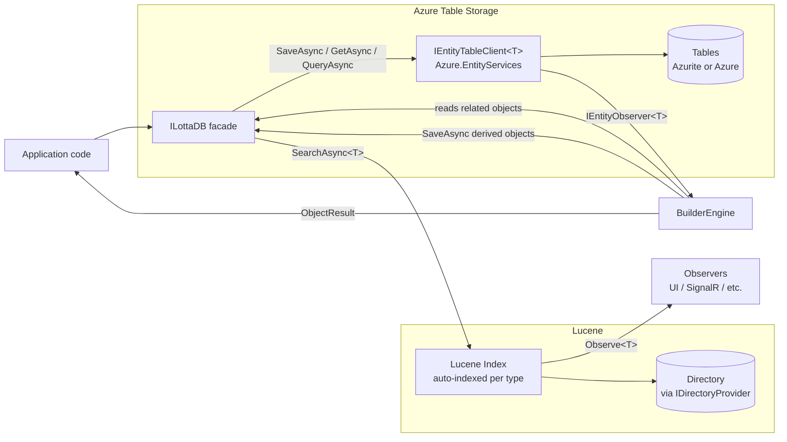

# LottaDB Architecture

## Overview

LottaDB is a .NET library that stores **POCOs in Azure Table Storage** and automatically indexes them into **Lucene** for rich queries. When an object is saved, user-defined **builders** can produce additional derived objects that are also stored and indexed — enabling denormalized, query-optimized projections that cascade automatically.

There is no distinction between "entities" and "views." **Everything is an object.** Some objects are written by application code, some are produced by builders. All objects live in Azure Table Storage and are automatically indexed into Lucene.

LottaDB is **unopinionated about data semantics**. Whether you use it for mutable objects (upsert by natural key), time-ordered immutable records (append with time-based keys), or a mix — that's your choice, expressed through the per-type mapping. LottaDB just stores what you give it and runs the builders.

A per-type **mapping** (modeled after [`Azure.EntityServices.Tables`](https://github.com/Aguafrommars/Azure.EntityServices)) tells LottaDB how to compute partition keys, row keys, and which properties to promote to native table columns ("tags"). The full POCO is always stored as JSON.

Storage backend: **Azure Table Storage**, accessed via `Azure.Data.Tables` + `Azure.EntityServices.Tables`. Local development and tests run against **[Azurite](https://github.com/Azure/Azurite)** — same wire protocol, same SDK, no separate in-memory provider.

### Design goals

1. **Store POCOs in Azure Table Storage** with a clean mapping — no `ITableEntity`, no infrastructure on the domain model.
2. **Auto-index everything into Lucene** — every object is searchable out of the box.
3. **Builders produce derived objects** that are stored and indexed like any other object, enabling cascading projections.
4. **Query with async LINQ** — `SearchAsync<T>()` for Lucene, `QueryAsync<T>()` for table storage.
5. **Rebuildable**: any Lucene index can be rebuilt from table storage.

## High-Level Components



## Core Concepts

### Everything is an object

Objects in LottaDB are ordinary classes. They do **not** implement `ITableEntity`, do **not** inherit a base class, and do **not** carry `PartitionKey` / `RowKey` / `ETag` / `Timestamp` properties.

```csharp
public class Actor
{
    public string Domain       { get; set; }
    public string Username     { get; set; }
    public string DisplayName  { get; set; }
    public string AvatarUrl    { get; set; }
}

public class Note
{
    public string NoteId     { get; set; }
    public string AuthorId   { get; set; }
    public string Domain     { get; set; }
    public string Content    { get; set; }
    public DateTimeOffset Published { get; set; }
    public List<string> Tags { get; set; }
}

// A derived object — produced by a builder, but stored and indexed like any other object
public class NoteView
{
    public string NoteId          { get; set; }
    public string AuthorUsername  { get; set; }
    public string AuthorDisplay   { get; set; }
    public string AvatarUrl       { get; set; }
    public string Content         { get; set; }
    public DateTimeOffset Published { get; set; }
    public string[] Tags          { get; set; }
}
```

All three are objects. `Actor` and `Note` are written by application code. `NoteView` is produced by a builder when a `Note` or `Actor` is saved. All three are stored in Azure Table Storage and auto-indexed into Lucene.

### Object Mapping

`ObjectMapping<T>` is LottaDB's per-type configuration, a thin wrapper over `Azure.EntityServices.Tables`'s `EntityTableClientConfig<T>`. It defines:

- **Table name** — defaults to the **CLR type name**, lowercased (e.g., `Note` → `notes`). Override with `SetTableName()` if needed.
- **Partition key resolver** — a `Func<T, string>` (or constant). This is the only required configuration.
- **Row key resolver** — a `Func<T, string>`. Can be a natural key, descending-time, ascending-time, or any custom function.
- **Tags** — properties promoted to native table columns so they can be filtered/sorted server-side.
- **Computed tags** — derived values written as columns but not stored on the POCO.

Each registered object type gets **its own Azure table** (one table per CLR type). The partition key provides the within-table grouping dimension.

Minimal mapping — only partition key and row key are needed:

```csharp
opts.Map<Actor>(m =>
{
    m.SetPartitionKey(a => a.Domain);       // required
    m.SetRowKey(a => a.Username);           // natural key
    // table name defaults to "actors"
});
```

Full mapping with tags:

```csharp
opts.Map<Note>(m =>
{
    m.SetPartitionKey(n => n.Domain);
    m.SetRowKey(RowKeyStrategy.DescendingTime(n => n.Published));
    m.AddTag(n => n.AuthorId);
    m.AddTag(n => n.Published);
    m.AddComputedTag("Year", n => n.Published.Year);
});
```

The row key strategy determines the storage semantics:

| Strategy | RowKey | Behavior | Use case |
|----------|--------|----------|----------|
| `o => o.OrderId` (natural key) | `order-42` | **Upsert** — one row per object, latest state | Mutable objects (users, profiles) |
| `RowKeyStrategy.DescendingTime(o => o.Published)` | `0250479199999_01HW...` | **Insert** — new row every write, newest first | Time-ordered records (activities, posts) |
| `RowKeyStrategy.AscendingTime(o => o.Published)` | `0638792800000_01HW...` | **Insert** — new row every write, oldest first | Logs, audit trails |
| Custom `Func<T,string>` | anything | Whatever you need | Composite keys, domain-specific ordering |

`SaveAsync` is always an **upsert** (insert-or-replace) at the Azure Table Storage level. For natural-key objects this overwrites the existing row. For time-keyed objects every write has a unique RowKey, so the upsert is effectively an insert.

When stored, a row looks like:

| Column         | Value                                                               |
|----------------|---------------------------------------------------------------------|
| PartitionKey   | `example.com`                                                       |
| RowKey         | `0250479199999_01HW...` *(or natural key)*                          |
| Timestamp      | server-assigned                                                     |
| ETag           | server-assigned                                                     |
| `_json`        | `{"noteId":"...","authorId":"...","content":"...", ...}`            |
| AuthorId       | `alice`        *(tag)*                                              |
| Published      | `2026-04-10T...` *(tag)*                                           |
| Year           | `2026`         *(computed tag)*                                     |

The full POCO graph is preserved losslessly in `_json`. Tags exist purely as a write-side index for cheap server-side filtering; on read, the POCO is always rehydrated from `_json`.

**Every object is automatically indexed into Lucene.** No opt-in needed. `SearchAsync<Note>()` works out of the box.

### ILottaDB facade

Storage is handled by [`Azure.EntityServices.Tables`](https://github.com/Aguafrommars/Azure.EntityServices) via `IEntityTableClient<T>`. For each registered object type, an `IEntityTableClient<T>` is created from the `ObjectMapping<T>` and cached internally.

What LottaDB owns is a thin **`ILottaDB`** facade whose job is to:

1. Own the per-type `IEntityTableClient<T>` instances and Lucene indexes.
2. **Auto-index every object into Lucene on save.**
3. **Run builders after every write**, which may produce additional objects (stored and indexed the same way).
4. **Detect cycles** in builder chains to prevent infinite loops.

```csharp
public interface ILottaDB
{
    // === Write ===

    // Save: upsert to table storage, auto-index into Lucene, run builders
    Task<ObjectResult> SaveAsync<T>(T entity, CancellationToken ct = default);

    // Delete: remove from table storage and Lucene, run builders
    Task<ObjectResult> DeleteAsync<T>(string partitionKey, string rowKey, CancellationToken ct = default);

    // === Read (table storage) ===

    // Point-read by key
    Task<T?> GetAsync<T>(string partitionKey, string rowKey, CancellationToken ct = default);

    // Async LINQ against table storage (tag predicates push down to OData)
    IAsyncQueryable<T> QueryAsync<T>();

    // === Read (Lucene) ===

    // Async LINQ against Lucene (full-text search, rich queries)
    IAsyncQueryable<T> SearchAsync<T>();

    // === Observe ===

    // Subscribe to changes for any object type (user-written or builder-produced)
    IDisposable Observe<T>(Func<ObjectChange<T>, Task> handler);

    // === Maintain ===

    // Rebuild the Lucene index for a type from table storage
    Task RebuildIndex<T>(CancellationToken ct = default);

    // === Escape hatch ===

    // Raw Azure.EntityServices client (bypasses builders and indexing)
    IEntityTableClient<T> Table<T>();
}
```

`SaveAsync` and `DeleteAsync` return an `ObjectResult` containing all the objects that were created, updated, or deleted — both the original object and any derived objects produced by builders.

`QueryAsync<T>()` and `SearchAsync<T>()` both return `IAsyncQueryable<T>` (from `System.Linq.Async`). Async-only — everything in LottaDB is I/O-bound.

```csharp
// Save an object — triggers builders, auto-indexes into Lucene
var result = await lottaDb.SaveAsync(note);

// Point-read from table storage
var actor = await lottaDb.GetAsync<Actor>("example.com", "alice");

// Query table storage (tag-filtered)
var notes = await lottaDb.QueryAsync<Note>()
    .Where(n => n.Domain == "example.com" && n.AuthorId == "alice")
    .OrderByDescending(n => n.Published)
    .Take(20)
    .ToListAsync();

// Search Lucene (rich queries, full-text)
var results = await lottaDb.SearchAsync<NoteView>()
    .Where(v => v.Tags.Contains("csharp") && v.Published > cutoff)
    .OrderByDescending(v => v.Published)
    .Take(20)
    .ToListAsync();

// Stream from Lucene
await foreach (var view in lottaDb.SearchAsync<NoteView>()
    .Where(v => v.AuthorUsername == "alice"))
{
    Process(view);
}

// Delete — triggers builders to clean up derived objects
var deleteResult = await lottaDb.DeleteAsync<Note>("example.com", noteRowKey);

// Observe changes to any type
var subscription = lottaDb.Observe<NoteView>(async change =>
{
    await hub.Clients.All.SendAsync("noteChanged", change);
});
```

For `QueryAsync<T>()`, predicates against **tagged** properties are translated to server-side OData filters and pushed down to Azure Table Storage; predicates against **non-tagged** properties are evaluated client-side after JSON deserialization. For `SearchAsync<T>()`, the LINQ provider is `Iciclecreek.Lucene.Net.Linq`.

**Local development and tests use [Azurite](https://github.com/Azure/Azurite)**. The test connection string is `UseDevelopmentStorage=true`; tests exercise the same code path as production.

```csharp
services.AddLottaDB(opts =>
{
    opts.UseAzureTables("UseDevelopmentStorage=true");   // Azurite for dev/test
    // or: opts.UseAzureTables(productionConnectionString);
});
```

### Builders

A **builder** is triggered when an object of a specific type is saved or deleted. It receives the object, the operation, and the `ILottaDB` facade. It produces zero or more derived objects that are saved back through the same pipeline — stored in table storage, auto-indexed into Lucene, and potentially triggering further builders.

```csharp
public enum TriggerKind { Saved, Deleted }

public interface IBuilder<TTrigger, TDerived>
{
    /// <summary>
    /// Called whenever a TTrigger object is saved or deleted. Returns zero or
    /// more derived objects to save (or keys to delete) via the same pipeline.
    /// </summary>
    IAsyncEnumerable<BuildResult<TDerived>> BuildAsync(
        TTrigger entity,
        TriggerKind trigger,
        ILottaDB db,
        CancellationToken ct);
}

/// <summary>
/// Result from a builder — either a save or a delete of a derived object.
/// </summary>
public record BuildResult<T>
{
    public T? Object { get; init; }              // non-null = save this object; null = delete by Key
    public string? Key { get; init; }            // used for delete (partition key + row key, or entity key)
}
```

#### Smart defaults

The engine applies sensible defaults so most builders only need to handle the happy path:

| Scenario | Default behavior |
|----------|-----------------|
| **`Deleted` trigger, builder yields zero results** | Engine **auto-deletes** derived objects by the trigger object's entity key. You only handle delete explicitly if you need custom logic. |
| **`Saved` trigger, builder yields zero results** | Engine does **nothing**. This lets builders conditionally skip (e.g., "only build views for published notes"). |

#### Example — builder that produces a denormalized NoteView

```csharp
public class NoteViewBuilder : IBuilder<Note, NoteView>
{
    public async IAsyncEnumerable<BuildResult<NoteView>> BuildAsync(
        Note note, TriggerKind trigger, ILottaDB db,
        [EnumeratorCancellation] CancellationToken ct)
    {
        // On delete, yield nothing — engine auto-deletes by entity key
        if (trigger == TriggerKind.Deleted)
            yield break;

        var author = await db.GetAsync<Actor>(note.Domain, note.AuthorId, ct);

        yield return new BuildResult<NoteView>
        {
            Object = new NoteView
            {
                NoteId         = note.NoteId,
                AuthorUsername = author?.Username ?? "",
                AuthorDisplay  = author?.DisplayName ?? "",
                AvatarUrl      = author?.AvatarUrl ?? "",
                Content        = note.Content,
                Published      = note.Published,
                Tags           = note.Tags?.ToArray() ?? Array.Empty<string>(),
            }
        };
    }
}
```

#### Cascading builders

When a related object changes, builders can query Lucene to find affected derived objects and rebuild them. Since derived objects are just objects, they can trigger further builders — enabling **view-on-view cascading**.

```csharp
// When an Actor changes, rebuild every NoteView for that actor
public class ActorChangedToNoteViewBuilder : IBuilder<Actor, NoteView>
{
    public async IAsyncEnumerable<BuildResult<NoteView>> BuildAsync(
        Actor actor, TriggerKind trigger, ILottaDB db,
        [EnumeratorCancellation] CancellationToken ct)
    {
        // Find all NoteViews for this actor via Lucene
        var affected = await db.SearchAsync<NoteView>()
            .Where(v => v.AuthorUsername == actor.Username)
            .ToListAsync(ct);

        if (trigger == TriggerKind.Deleted)
        {
            foreach (var view in affected)
                yield return new BuildResult<NoteView> { Key = view.NoteId, Object = null };
            yield break;
        }

        // Rebuild each affected NoteView with updated actor info
        foreach (var view in affected)
        {
            var note = await db.GetAsync<Note>(view.NoteId, view.NoteId, ct);
            if (note == null) continue;

            yield return new BuildResult<NoteView>
            {
                Object = new NoteView
                {
                    NoteId         = note.NoteId,
                    AuthorUsername = actor.Username,
                    AuthorDisplay  = actor.DisplayName,
                    AvatarUrl      = actor.AvatarUrl,
                    Content        = note.Content,
                    Published      = note.Published,
                    Tags           = note.Tags?.ToArray() ?? Array.Empty<string>(),
                }
            };
        }
    }
}
```

The pattern: **search Lucene to find affected objects, re-read source data from table storage, rebuild.**

Since `NoteView` is an object too, saving it can trigger *its own* builders — for example, a `FeedBuilder` that produces `FeedEntry` objects from `NoteView` changes. The engine detects cycles (same object key processed twice in one chain) and stops.

### Builder Engine

The `BuilderEngine` is registered as an `IEntityObserver<T>` on each object type's `IEntityTableClient<T>`. When a row is written or deleted, the observer fires:

1. **On delete**: loads the object from table storage *before* the delete is applied, so the builder receives the full object.
2. Looks up all `IBuilder<T, *>` registrations for the object's CLR type.
3. Invokes each builder with the object and `TriggerKind` (`Saved` or `Deleted`).
4. For each `BuildResult<T>`: if `Object` is non-null → **save** via `SaveAsync` (which triggers that type's builders in turn); if `Object` is null → **delete** by key.
5. If the trigger is `Deleted` and a builder yields zero results → **auto-delete** derived objects by the trigger object's entity key.
6. **Cycle detection**: tracks object keys processed in the current chain. If the same key appears again, the chain stops for that branch.
7. Notifies all registered observers.
8. Collects all changes into the `ObjectResult` returned to the caller.

Projection runs **inline by default** so reads after writes are consistent. An optional dispatcher allows queueing to a background channel for high-throughput scenarios.

### Observers & ObjectResult

LottaDB provides two ways to access the changes produced by a write:

#### 1. ObjectResult (synchronous return)

`SaveAsync` and `DeleteAsync` return an `ObjectResult` containing everything that changed:

```csharp
public record ObjectResult
{
    public IReadOnlyList<ObjectChange> Changes { get; init; }
}

public record ObjectChange
{
    public string TypeName { get; init; }        // e.g., "NoteView"
    public string Key { get; init; }             // entity key
    public ChangeKind Kind { get; init; }        // Saved or Deleted
    public object? Object { get; init; }         // the full typed object (or null if deleted)
}

public enum ChangeKind { Saved, Deleted }
```

Usage:

```csharp
var result = await lottaDb.SaveAsync(note);

foreach (var change in result.Changes)
{
    if (change.Object is NoteView noteView)
        Console.WriteLine($"{change.Kind}: {noteView.NoteId} by {noteView.AuthorDisplay}");
}
```

#### 2. Observe&lt;T&gt; (decoupled, async callback)

For consumers that want to react to changes without being the caller of `SaveAsync`:

```csharp
public record ObjectChange<T>
{
    public string Key { get; init; }
    public T? Object { get; init; }              // full typed object; null = deleted
    public ChangeKind Kind { get; init; }
}
```

Usage:

```csharp
// Subscribe — returns IDisposable for unsubscription
var subscription = lottaDb.Observe<NoteView>(async change =>
{
    await hub.Clients.Group(change.Key).SendAsync("noteChanged", change);
});

// Later: unsubscribe
subscription.Dispose();
```

Multiple observers can be registered per type. Observers are invoked after the object has been saved to table storage and indexed into Lucene.

#### How it all connects

**Save flow:**

```mermaid
sequenceDiagram
    participant App
    participant Lotta as ILottaDB
    participant ATS as Azure Table Storage
    participant Lucene as Lucene Index
    participant Eng as BuilderEngine
    participant Obs as Observe&lt;T&gt;

    App->>Lotta: SaveAsync(note)
    Lotta->>ATS: upsert row (JSON + tags)
    Lotta->>Lucene: index note
    Lotta->>Eng: run builders(note, Saved)
    Eng->>Lotta: GetAsync(actor)
    Lotta-->>Eng: actor
    Eng->>Lotta: SaveAsync(noteView)
    Lotta->>ATS: upsert NoteView row
    Lotta->>Lucene: index NoteView
    Lotta->>Obs: ObjectChange&lt;NoteView&gt;
    Eng-->>Lotta: all changes collected
    Lotta-->>App: ObjectResult
```

**Delete flow:**

```mermaid
sequenceDiagram
    participant App
    participant Lotta as ILottaDB
    participant ATS as Azure Table Storage
    participant Lucene as Lucene Index
    participant Eng as BuilderEngine
    participant Obs as Observe&lt;T&gt;

    App->>Lotta: DeleteAsync(pk, rk)
    Lotta->>ATS: load note (before delete)
    ATS-->>Lotta: note
    Lotta->>ATS: delete row
    Lotta->>Lucene: remove from index
    Lotta->>Eng: run builders(note, Deleted)
    Eng->>Lotta: DeleteAsync(noteView)
    Lotta->>ATS: delete NoteView row
    Lotta->>Lucene: remove NoteView from index
    Lotta->>Obs: ObjectChange&lt;NoteView&gt; (Deleted)
    Eng-->>Lotta: all changes collected
    Lotta-->>App: ObjectResult
```

### Lucene Indexing

Every registered object type is automatically indexed into Lucene. One Lucene index (one `Directory`) per type.

- Schema is inferred from the POCO via `Iciclecreek.Lucene.Net.Linq` attributes (`[Field]`, `[NumericField]`, etc.) or convention.
- The `Directory` is **pluggable** via an `IDirectoryProvider`:

```csharp
public interface IDirectoryProvider
{
    Lucene.Net.Store.Directory GetDirectory(string typeName);
}
```

Built-in providers:

- `FSDirectoryProvider` — local filesystem (default for production).
- `RAMDirectoryProvider` — in-memory (default for tests).
- Room for `AzureBlobDirectoryProvider` or any community Directory implementation.

## Registration & Composition

```csharp
services.AddLottaDB(opts =>
{
    opts.UseAzureTables(connectionString);
    opts.UseLuceneDirectory(new FSDirectoryProvider("./lucene-indexes"));

    // Mutable object — natural key, one row per actor
    opts.Map<Actor>(m =>
    {
        m.SetPartitionKey(a => a.Domain);
        m.SetRowKey(a => a.Username);
        m.AddTag(a => a.DisplayName);
    });

    // Time-ordered object — descending time, one row per write
    opts.Map<Note>(m =>
    {
        m.SetPartitionKey(n => n.Domain);
        m.SetRowKey(RowKeyStrategy.DescendingTime(n => n.Published));
        m.AddTag(n => n.AuthorId);
        m.AddTag(n => n.Published);
    });

    // Derived object — natural key, produced by builders
    opts.Map<NoteView>(m =>
    {
        m.SetPartitionKey(v => v.NoteId);
        m.SetRowKey(v => v.NoteId);
    });

    // Builders: Note → NoteView, Actor → NoteView
    opts.AddBuilder<Note,  NoteView, NoteViewBuilder>();
    opts.AddBuilder<Actor, NoteView, ActorChangedToNoteViewBuilder>();

    // Optional: observe NoteView changes at composition time
    opts.Observe<NoteView>(async change =>
    {
        await hub.Clients.All.SendAsync("noteChanged", change);
    });
});
```

Note:
- `Actor` uses a natural key (upsert — one row per actor), `Note` uses descending time (append — one row per write). Both work the same way.
- `NoteView` is registered as an object type like any other — it needs its own mapping because it's stored in table storage too.
- No `SearchAsync<Note>()` opt-in needed — all registered types are auto-indexed.
- Observers can also be registered at runtime via `lottaDb.Observe<T>(...)`.

## Rebuild & Backfill

LottaDB exposes `RebuildIndex<T>()` to rebuild the Lucene index for any type:

1. Drops or creates the Lucene index for `T`.
2. Streams every object of that type from table storage via `QueryAsync<T>()`.
3. Re-indexes each object into Lucene.
4. Commits in batches.

This is the recovery mechanism. If Lucene data is lost, corrupted, or the indexing schema changes, rebuild it. Table storage is the system of record; Lucene is disposable.

Note: `RebuildIndex<T>()` re-indexes objects from table storage into Lucene. It does **not** re-run builders. To re-derive objects (e.g., after changing a builder's logic), delete the derived objects and re-save the source objects, or provide a migration script.

Tag columns can be regenerated by replaying every row's `_json` through the current `ObjectMapping<T>` — useful when adding a new tag to an existing object type.

## Project Layout (proposed)

```
/src
  LottaDB                          // ObjectMapping<T>, RowKeyStrategy, BuilderEngine, ILottaDB
  LottaDB.Lucene                   // Lucene indexing, IDirectoryProvider, SearchAsync provider
/test
  LottaDB.Tests                    // run against Azurite
```

## Key Design Decisions

| Decision | Rationale |
|---|---|
| **Everything is an object** | No entity/view distinction. Derived objects are stored and indexed like any other object. Simplifies the mental model and enables cascading. |
| **Auto-index into Lucene** | Every object is searchable via `SearchAsync<T>()` with zero configuration. |
| **Builders produce objects, not "view documents"** | Builder output goes through the same save pipeline — stored in table storage, indexed in Lucene, triggers further builders. Cascading is free. |
| **Cycle detection in builder chains** | Prevents infinite loops when builders cascade (A→B→A). |
| **Smart defaults (auto-delete, skip-on-empty)** | Most builders only handle the happy path. Delete cleanup works out of the box. |
| **`SaveAsync` / `SearchAsync` / `QueryAsync` / `GetAsync`** | Clean verb split: Save writes, Get point-reads, Query scans table storage, Search queries Lucene. |
| **`IAsyncQueryable<T>` — async-only LINQ** | Everything is I/O-bound; no reason to offer sync. |
| **Unopinionated about data semantics** | Natural keys → upsert; time keys → append. The library doesn't care. |
| **One table per CLR type, name inferred** | Table name defaults to lowercased type name; no boilerplate. |
| **`SaveAsync` is always upsert** | No insert/upsert distinction. One operation, no ambiguity. |
| Objects are plain POCOs | Domain models stay clean; PK/RK/tags are infrastructure, configured via mapping. |
| Mapping modeled on `Azure.EntityServices.Tables` | Reuse a battle-tested mapping/tags model. |
| Azure Table Storage (Azurite for dev/test) | One backend, one code path. |
| Tags = property promotion | Server-side filterable hot fields without sacrificing the JSON document. |
| Full POCO as JSON in `_json` column | The POCO is the source of truth; reads always rehydrate from JSON. |
| **`ObjectResult` + `Observe<T>` — both access patterns** | Synchronous callers get all changes in the return value; decoupled consumers subscribe to typed observer callbacks. |
| **Builder engine is an `IEntityObserver<T>`** | Hooks into `Azure.EntityServices`' built-in observer mechanism. |
| Inline by default | Read-after-write consistency for the writer. |
| Lucene `Directory` is pluggable | Same indexing code works on disk, in RAM, or in blob storage. |
| Builders are explicit and typed | Projections are discoverable, testable, and rebuildable. |
| LINQ via Iciclecreek.Lucene.Net.Linq | Strongly-typed queries returning POCOs. |
| One Lucene index per type | Clean schema, isolated rebuilds, simpler concurrency. |

## Out of Scope (initially)

- Change logs / event sourcing (layer this on top if you need it).
- Cross-view transactions.
- Distributed builder coordination across multiple writer processes.
- Full-text analyzer customization beyond what `Iciclecreek.Lucene.Net.Linq` exposes by default.
- Builder re-derivation (re-running builders to regenerate derived objects after logic changes).
