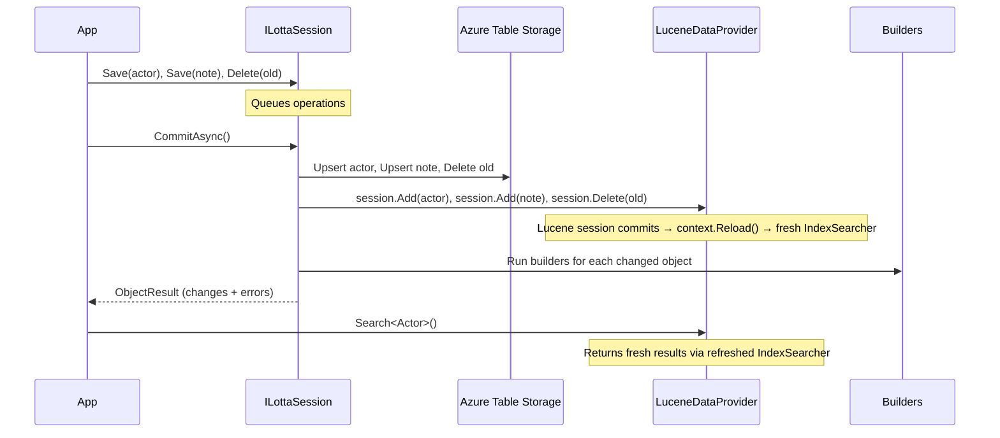

# LottaDB Architecture

## Overview

LottaDB is a .NET library that stores **POCOs in Azure Table Storage** and automatically indexes them into **Lucene** for rich queries. A LottaDB instance is a **single database** — one Azure table, one Lucene index, identified by a name. Types are discriminated by a `_Type` column/field, not by separate tables or indexes.

Writes go through **sessions** — batch multiple operations, then commit. After commit, `Search<T>()` sees all changes immediately (Lucene reopens its IndexSearcher on commit). This mirrors the `LuceneDataProvider` session pattern from `Iciclecreek.Lucene.Net.Linq`.

Materialized views are declared as **LINQ join expressions** via `CreateView<T>()` — LottaDB parses the expression tree, extracts dependencies and join keys, and incrementally maintains the derived objects.

### Design goals

1. **Session-based writes.** Batch saves/deletes, commit once. Efficient and consistent.
2. **One database = one table + one index.** No per-type tables or indexes.
3. **`[Key]` is the only required attribute.**
4. **`_Type` hierarchy enables polymorphic queries.**
5. **`Search<T>()` always reflects committed state.** Lucene IndexSearcher refreshes on commit.
6. **Materialized views as LINQ joins** via `CreateView<T>()`.

## The Database

A `LottaDB` instance represents a single database:

- **Name** — used as the Azure table name and Lucene index name.
- **One Azure table** — all types in the same table, `PartitionKey = typeof(T).Name`.
- **One Lucene index** — all types in one index, `_Type` field for discrimination.
- **`TableServiceClient`** + **`Directory`** — passed in the constructor. DI-neutral.

```csharp
// Direct construction
var db = new LottaDB("myapp", tableServiceClient, directory, opts =>
{
    opts.Store<Actor>();
    opts.Store<Note>();
});
```

## Core Concepts

### Everything is an object

Objects are ordinary classes. The only required annotation is `[Key]`.

```csharp
public class Actor
{
    [Key]
    [Field(Key = true)]
    public string Username { get; set; } = "";

    [Tag]
    [Field(IndexMode.NotAnalyzed)]
    public string DisplayName { get; set; } = "";

    public string AvatarUrl { get; set; } = "";
}
```

`[Key]` = LottaDB's key (Azure Table Storage RowKey).
`[Field(Key = true)]` = Lucene's document key (for upsert behavior in sessions).
Both should be on the same property.

### Sessions (write model)

All writes go through sessions. A session batches operations and commits them atomically to both table storage and Lucene.

```csharp
public interface ILottaDB
{
    // Open a session for batched writes
    ILottaSession OpenSession();

    // Convenience: single-operation session (open, save, commit)
    Task SaveAsync<T>(T entity, CancellationToken ct = default);
    Task DeleteAsync<T>(string key, CancellationToken ct = default);

    // Read (always reflects last committed state)
    Task<T?> GetAsync<T>(string key, CancellationToken ct = default);
    IQueryable<T> Query<T>();     // table storage
    IQueryable<T> Search<T>();    // Lucene
    IQueryable<T> Search<T>(string query);  // Lucene with query string

    // Observe
    IDisposable Observe<T>(Func<ObjectChange<T>, Task> handler);

    // Maintain
    Task RebuildIndex(CancellationToken ct = default);
}

public interface ILottaSession : IDisposable
{
    // Queue writes (not committed until Commit is called)
    void Save<T>(T entity) where T : class, new();
    void Save<T>(string key, T entity) where T : class, new();
    void Delete<T>(string key) where T : class, new();
    void Delete<T>(T entity) where T : class, new();

    // Commit all queued writes to table storage + Lucene
    // After commit, Search<T>() sees the new data (IndexSearcher refreshes)
    // Builders run after commit
    Task<ObjectResult> CommitAsync(CancellationToken ct = default);
}
```

**Usage:**

```csharp
// Batched writes
using (var session = db.OpenSession())
{
    session.Save(new Actor { Username = "alice", DisplayName = "Alice" });
    session.Save(new Actor { Username = "bob", DisplayName = "Bob" });
    session.Save(new Note { NoteId = "n1", AuthorId = "alice", Content = "Hello" });
    session.Delete<Actor>("old-actor");

    var result = await session.CommitAsync();
    // result.Changes contains all saved/deleted objects
    // result.Errors contains any builder failures
}

// Search sees committed data immediately
var actors = db.Search<Actor>().Where(a => a.DisplayName == "Alice").ToList();

// Convenience: single-operation (opens session, saves, commits)
await db.SaveAsync(new Actor { Username = "carol", DisplayName = "Carol" });
```

### How sessions work internally



### The `[Key]` attribute

`[Key]` marks the unique identity property. Becomes the RowKey in Azure Table Storage.

| Strategy | Key value | Behavior |
|----------|-----------|----------|
| `KeyStrategy.Natural` (default) | Property value | **Upsert** — one row per object |
| `KeyStrategy.DescendingTime` | Inverted ticks + ULID | **Append** — newest first |
| `KeyStrategy.AscendingTime` | Ticks + ULID | **Append** — oldest first |
| Fluent `SetKey(Func<T, string>)` | Computed string | Custom composite keys |

### The `_Type` hierarchy

Every object gets a `_Type` field with its full type hierarchy. Enables polymorphic queries:

```csharp
db.Search<Actor>();          // only Actors
db.Search<BaseEntity>();     // Actors, Notes, everything extending BaseEntity
```

### Materialized Views via CreateView

```csharp
opts.CreateView<NoteView>(db =>
    from note in db.Query<Note>()
    join actor in db.Query<Actor>()
        on note.AuthorId equals actor.Username
    select new NoteView { ... }
);
```

`CreateView` uses `db.Query<T>()` (table storage) for joins. After a source object commits, LottaDB re-executes the view expression and commits the derived objects (which also go through a Lucene session commit → searcher refresh).

### Explicit Builders (escape hatch)

```csharp
public interface IBuilder<TTrigger, TDerived>
{
    IAsyncEnumerable<BuildResult<TDerived>> BuildAsync(
        TTrigger entity, TriggerKind trigger, ILottaDB db, CancellationToken ct);
}
```

For custom logic that can't be expressed as a LINQ join.

### Observers

```csharp
db.Observe<NoteView>(async change =>
{
    await hub.Clients.All.SendAsync("noteChanged", change);
});
```

Observers fire after commit, for each changed object.

## Scaling Model

LottaDB targets **small-to-medium workloads** — per-user, per-tenant. Scaling is horizontal by creating **separate LottaDB instances per tenant**.

## Key Design Decisions

| Decision | Rationale |
|---|---|
| **Session-based writes** | Batch operations, single commit to table storage + Lucene. Mirrors LuceneDataProvider's session pattern. IndexSearcher refreshes on commit. |
| **One table + one index per database** | Simple. Types discriminated by PartitionKey / `_Type`. |
| **`[Key]` is the only required attribute** | No partition keys, no row keys. LottaDB handles internals. |
| **`_Type` hierarchy for polymorphic queries** | `Search<BaseClass>()` returns all derived types. |
| **Single Lucene Directory per DB** | One LuceneDataProvider, one writer, searcher refreshes on commit. |
| **DI-neutral** | Constructor takes dependencies directly. Optional DI extension. |
| **`Query<T>()` for joins, `Search<T>()` for search** | Query = table storage. Search = Lucene. |
| **Convenience `SaveAsync`/`DeleteAsync`** | Single-operation shortcuts that open a session, operate, commit. |
| **Per-tenant database instances** | Scaling model bounds all concerns. |

## Out of Scope (initially)

- Change logs / event sourcing.
- Cross-database transactions.
- Distributed builder coordination.
- Complex LINQ in `CreateView` beyond joins (group by, aggregations).
