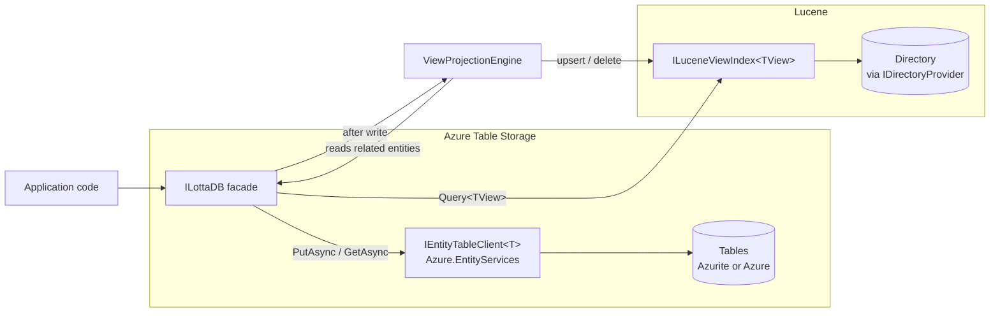

# LottaDB Architecture

## Overview

LottaDB is a .NET library that stores **POCOs in Azure Table Storage** and maintains **Lucene-backed materialized views**.

Applications hand LottaDB ordinary POCOs. `PutAsync` writes a row to Azure Table Storage, then runs user-defined view builders that read related entities and produce denormalized view documents indexed into Lucene. Queries against views are expressed in LINQ via `Iciclecreek.Lucene.Net.Linq` and return strongly-typed objects.

LottaDB is **unopinionated about data semantics**. Whether you use it for mutable entities (upsert by natural key), time-ordered immutable records (append with time-based keys), or a mix — that's your choice, expressed through the per-type `EntityMapping<T>`. LottaDB just stores what you give it and runs the projections.

A per-type **mapping** (modeled after [`Azure.EntityServices.Tables`](https://github.com/Aguafrommars/Azure.EntityServices)) tells LottaDB how to compute partition keys, row keys, and which properties to promote to native table columns ("tags"). The full POCO is always stored as JSON.

Storage backend: **Azure Table Storage**, accessed via `Azure.Data.Tables` + `Azure.EntityServices.Tables`. Local development and tests run against **[Azurite](https://github.com/Azure/Azurite)** — same wire protocol, same SDK, no separate in-memory provider.

### Design goals

1. **Store POCOs in Azure Table Storage** with a clean mapping — no `ITableEntity`, no infrastructure on the domain model.
2. **Promote hot properties to tags** for server-side filtering without polluting the domain model.
3. **Materialize views into Lucene** automatically when entities are written.
4. **Query views with LINQ** and get back POCOs.
5. **Rebuildable**: any view can be rebuilt from table storage.

## High-Level Components



## Core Concepts

### Entities are plain POCOs

Entities in LottaDB are ordinary classes. They do **not** implement `ITableEntity`, do **not** inherit a base class, and do **not** carry `PartitionKey` / `RowKey` / `ETag` / `Timestamp` properties.

```csharp
public class Order
{
    public string TenantId   { get; set; }
    public string OrderId    { get; set; }
    public string CustomerId { get; set; }
    public decimal Total     { get; set; }
    public DateTimeOffset CreatedAt { get; set; }
    public List<OrderLine> Lines { get; set; }
}
```

How that POCO becomes a table row is described entirely by an **`EntityMapping<T>`** registered at composition time.

### Entity Mapping

`EntityMapping<T>` is LottaDB's per-type configuration, a thin wrapper over `Azure.EntityServices.Tables`'s `EntityTableClientConfig<T>`. A mapping defines:

- **Table name** — defaults to the **CLR type name**, lowercased (e.g., `Order` → `orders`). Override with `SetTableName()` if needed.
- **Partition key resolver** — a `Func<T, string>` (or constant). This is the only required configuration.
- **Row key resolver** — a `Func<T, string>`. Can be a natural key, descending-time, ascending-time, or any custom function.
- **Tags** — properties promoted to native table columns so they can be filtered/sorted server-side.
- **Computed tags** — derived values written as columns but not stored on the POCO.

Each registered entity type gets **its own Azure table** (one table per CLR type). The partition key provides the within-table grouping dimension.

Minimal mapping — only partition key and row key are needed:

```csharp
opts.Entity<Actor>(e =>
{
    e.SetPartitionKey(a => a.Domain);       // required
    e.SetRowKey(a => a.Username);           // natural key
    // table name defaults to "actors"
});
```

Full mapping with tags:

```csharp
opts.Entity<Order>(e =>
{
    e.SetPartitionKey(o => $"tenant:{o.TenantId}");
    e.SetRowKey(o => o.OrderId);

    e.AddTag(o => o.CustomerId);
    e.AddTag(o => o.Total);
    e.AddTag(o => o.CreatedAt);
    e.AddComputedTag("Year", o => o.CreatedAt.Year);
});
```

The row key strategy determines the storage semantics:

| Strategy | RowKey | Behavior | Use case |
|----------|--------|----------|----------|
| `o => o.OrderId` (natural key) | `order-42` | **Upsert** — one row per entity, latest state | Mutable entities (users, profiles) |
| `RowKeyStrategy.DescendingTime(o => o.Published)` | `0250479199999_01HW...` | **Insert** — new row every write, newest first | Time-ordered records (activities, posts) |
| `RowKeyStrategy.AscendingTime(o => o.Published)` | `0638792800000_01HW...` | **Insert** — new row every write, oldest first | Logs, audit trails |
| Custom `Func<T,string>` | anything | Whatever you need | Composite keys, domain-specific ordering |

`PutAsync` is always an **upsert** (insert-or-replace) at the Azure Table Storage level. For natural-key entities this overwrites the existing row. For time-keyed entities every write has a unique RowKey, so the upsert is effectively an insert.

When stored, a row looks like:

| Column         | Value                                                               |
|----------------|---------------------------------------------------------------------|
| PartitionKey   | `tenant:acme`                                                       |
| RowKey         | `order-42` *(or time-based, depending on strategy)*                 |
| Timestamp      | server-assigned                                                     |
| ETag           | server-assigned                                                     |
| `_json`        | `{"tenantId":"acme","orderId":"...","lines":[...], ...}`            |
| CustomerId     | `cust-123`     *(tag)*                                              |
| Total          | `429.50`       *(tag)*                                              |
| CreatedAt      | `2026-04-09T...` *(tag)*                                            |
| Year           | `2026`         *(computed tag)*                                     |

The full POCO graph (including `Lines`) is preserved losslessly in `_json`. Tags exist purely as a write-side index for cheap server-side filtering; on read, the POCO is always rehydrated from `_json`.

### ILottaDB facade

LottaDB does **not** define its own `IEntityStore` abstraction. Storage is handled by [`Azure.EntityServices.Tables`](https://github.com/Aguafrommars/Azure.EntityServices) via `IEntityTableClient<T>`. For each registered entity type, an `IEntityTableClient<T>` is created from the `EntityMapping<T>` and cached internally.

What LottaDB *does* own is a thin **`ILottaDB`** facade whose job is to:

1. Own the per-type `IEntityTableClient<T>` instances.
2. **Fire the view projection engine after every write.**

```csharp
public interface ILottaDB
{
    // --- Write: store row, then run view builders ---
    Task PutAsync<T>(T entity, CancellationToken ct = default);

    // --- Read by key (point-read) ---
    Task<T?> GetAsync<T>(string partitionKey, string rowKey, CancellationToken ct = default);

    // --- Query table storage (tag-filtered, partition-scoped) ---
    IAsyncEnumerable<T> QueryAsync<T>(
        string partitionKey,
        Expression<Func<T, bool>>? filter = null,
        int? take = null,
        CancellationToken ct = default);

    // --- Query materialized views (LINQ to Lucene) ---
    IQueryable<TView> Query<TView>();

    // --- Rebuild a view by replaying all relevant entities through builders ---
    Task RebuildAsync<TView>(CancellationToken ct = default);

    // --- Escape hatch: raw Azure.EntityServices client ---
    IEntityTableClient<T> Table<T>();
}
```

The facade is intentionally simple. `PutAsync` upserts a row and runs the projection engine. `GetAsync` and `QueryAsync` read from table storage. `Query<TView>` reads from Lucene. That's it.

`IViewBuilder<TTrigger,TView>.BuildAsync` receives the `ILottaDB` facade so view builders can load related entities via `GetAsync` — the same interface the application uses.

**Local development and tests use [Azurite](https://github.com/Azure/Azurite)**. The test connection string is `UseDevelopmentStorage=true`; tests exercise the same code path as production.

```csharp
services.AddLottaDB(opts =>
{
    opts.UseAzureTables("UseDevelopmentStorage=true");   // Azurite for dev/test
    // or: opts.UseAzureTables(productionConnectionString);
});
```

### Materialized Views

A **materialized view** is a denormalized POCO purpose-built for a query pattern. Views live only in Lucene and can be rebuilt at any time from table storage.

```csharp
public class OrderSummaryView
{
    public string OrderId { get; set; }
    public string CustomerName { get; set; }
    public string CustomerEmail { get; set; }
    public decimal Total { get; set; }
    public string[] ProductNames { get; set; }
    public DateTimeOffset CreatedAt { get; set; }
}
```

Views are produced by an `IViewBuilder<TTrigger, TView>`:

```csharp
public interface IViewBuilder<TTrigger, TView>
{
    /// <summary>
    /// Called whenever a TTrigger entity is Put. The builder may read related
    /// entities via ILottaDB and return zero or more view documents to upsert
    /// into (or delete from) the Lucene index.
    /// </summary>
    IAsyncEnumerable<ViewResult<TView>> BuildAsync(TTrigger entity, ILottaDB db, CancellationToken ct);
}

/// <summary>
/// Result from a view builder — either an upsert or a delete.
/// </summary>
public record ViewResult<TView>
{
    public string Key { get; init; }
    public TView? View { get; init; }        // null = delete this key from the index
}
```

Example — an ActivityPub-style scenario with actors and notes:

```csharp
// Entities: Actor is upserted by natural key, Note is appended by time
public class Actor
{
    public string Domain       { get; set; }
    public string Username     { get; set; }
    public string DisplayName  { get; set; }
    public string AvatarUrl    { get; set; }
}

public class Note
{
    public string NoteId     { get; set; }
    public string AuthorId   { get; set; }
    public string Domain     { get; set; }
    public string Content    { get; set; }
    public DateTimeOffset Published { get; set; }
    public List<string> Tags { get; set; }
}

// Materialized view: denormalized note with author info baked in
public class NoteView
{
    public string NoteId          { get; set; }
    public string AuthorUsername  { get; set; }
    public string AuthorDisplay   { get; set; }
    public string AvatarUrl       { get; set; }
    public string Content         { get; set; }
    public DateTimeOffset Published { get; set; }
    public string[] Tags          { get; set; }
}

// View builder: when a Note is Put, load the author and produce a NoteView
public class NoteViewBuilder : IViewBuilder<Note, NoteView>
{
    public async IAsyncEnumerable<ViewResult<NoteView>> BuildAsync(
        Note note, ILottaDB db, [EnumeratorCancellation] CancellationToken ct)
    {
        var author = await db.GetAsync<Actor>(note.Domain, note.AuthorId, ct);

        yield return new ViewResult<NoteView>
        {
            Key = note.NoteId,
            View = new NoteView
            {
                NoteId         = note.NoteId,
                AuthorUsername = author?.Username ?? "",
                AuthorDisplay  = author?.DisplayName ?? "",
                AvatarUrl      = author?.AvatarUrl ?? "",
                Content        = note.Content,
                Published      = note.Published,
                Tags           = note.Tags?.ToArray() ?? Array.Empty<string>(),
            }
        };
    }
}
```

A trigger may fan out to **multiple** view builders, and one builder may emit **multiple** view results (e.g., an `Actor` change rewrites every `NoteView` for that actor's posts).

### View Projection Engine

```mermaid
sequenceDiagram
    participant App
    participant Lotta as ILottaDB
    participant ATS as Azure Table Storage
    participant Eng as ViewProjectionEngine
    participant Idx as ILuceneViewIndex&lt;TView&gt;

    App->>Lotta: PutAsync(note)
    Lotta->>ATS: write row (JSON + tags)
    ATS-->>Lotta: ok
    Lotta->>Eng: project(note)
    Eng->>Lotta: GetAsync(actor)
    Lotta->>ATS: point-read
    ATS-->>Lotta: actor
    Lotta-->>Eng: actor
    Eng->>Idx: Upsert or Delete (per ViewResult)
    Idx-->>Eng: ok
    Eng-->>Lotta: done
    Lotta-->>App: ok (read-after-write consistent)
```

The engine:

1. Looks up all `IViewBuilder<TEntity, *>` registrations for the written entity's CLR type.
2. Invokes each builder, which yields `ViewResult<TView>` items.
3. For each result: if `View` is non-null → **upsert** into Lucene; if `View` is null → **delete** from Lucene by key.

Projection runs **inline by default** so reads after writes are consistent. An optional `IProjectionDispatcher` allows queueing to a background channel for high-throughput scenarios.

### Lucene View Index

`ILuceneViewIndex<TView>` wraps a Lucene.Net `IndexWriter` / `IndexSearcher` pair for a single view type:

```csharp
public interface ILuceneViewIndex<TView>
{
    void Upsert(string key, TView view);
    void Delete(string key);
    IQueryable<TView> AsQueryable();   // Iciclecreek.Lucene.Net.Linq
    void Commit();
}
```

- One Lucene index (one `Directory`) per view type.
- Schema is inferred from the view POCO via `Iciclecreek.Lucene.Net.Linq` attributes (`[Field]`, `[NumericField]`, etc.) or convention.
- The `Directory` is **pluggable** via an `IDirectoryProvider`:

```csharp
public interface IDirectoryProvider
{
    Lucene.Net.Store.Directory GetDirectory(string viewName);
}
```

Built-in providers:

- `FSDirectoryProvider` — local filesystem (default for production).
- `RAMDirectoryProvider` — in-memory (default for tests).
- Room for `AzureBlobDirectoryProvider` or any community Directory implementation.

### Query API

**Point-read** from table storage:

```csharp
var actor = await lottaDb.GetAsync<Actor>("example.com", "alice");
```

**Table scan** (tag-filtered):

```csharp
await foreach (var note in lottaDb.QueryAsync<Note>("example.com", n => n.AuthorId == "alice", take: 20))
    Console.WriteLine($"{note.Published}: {note.Content}");
```

**Materialized view query** (LINQ to Lucene):

```csharp
var results = lottaDb.Query<NoteView>()
    .Where(v => v.Tags.Contains("csharp") && v.Published > cutoff)
    .OrderByDescending(v => v.Published)
    .Take(20)
    .ToList();
```

## Registration & Composition

```csharp
services.AddLottaDB(opts =>
{
    opts.UseAzureTables(connectionString);
    opts.UseLuceneDirectory(new FSDirectoryProvider("./lucene-views"));

    // Mutable entity — natural key, one row per actor
    // Table name defaults to "actors"
    opts.Entity<Actor>(e =>
    {
        e.SetPartitionKey(a => a.Domain);
        e.SetRowKey(a => a.Username);
        e.AddTag(a => a.DisplayName);
    });

    // Time-ordered entity — descending time, one row per write
    // Table name defaults to "notes"
    opts.Entity<Note>(e =>
    {
        e.SetPartitionKey(n => n.Domain);
        e.SetRowKey(RowKeyStrategy.DescendingTime(n => n.Published));
        e.AddTag(n => n.AuthorId);
        e.AddTag(n => n.Published);
    });

    opts.AddView<Note,  NoteView, NoteViewBuilder>();
    opts.AddView<Actor, NoteView, ActorChangedToNoteViewBuilder>();
});
```

Note how `Actor` uses a natural key (upsert — one row per actor) while `Note` uses descending time (append — one row per write). Both trigger view builders the same way. Neither needs `SetTableName()` — the CLR type name is used by convention.

## Rebuild & Backfill

Because views are projections from table storage, LottaDB exposes a `RebuildAsync<TView>()` operation that:

1. Drops or creates the Lucene index for `TView`.
2. Streams every relevant entity from table storage via `QueryAsync`.
3. Re-runs each registered builder for each entity.
4. Commits in batches.

This is the recovery mechanism. If Lucene data is lost, corrupted, or a view's shape changes, rebuild it. Table storage is the system of record; the view is disposable.

Tag columns can be regenerated by replaying every row's `_json` through the current `EntityMapping<T>` — useful when adding a new tag to an existing entity type.

## Project Layout (proposed)

```
/src
  LottaDB                          // EntityMapping<T>, RowKeyStrategy, ViewProjectionEngine, ILottaDB
  LottaDB.Lucene                   // ILuceneViewIndex, IDirectoryProvider
/test
  LottaDB.Tests                    // run against Azurite
```

## Key Design Decisions

| Decision | Rationale |
|---|---|
| **Unopinionated about data semantics** | Natural keys → upsert; time keys → append. The library doesn't care; the row key strategy determines behavior. |
| **One table per CLR type, name inferred** | Table name defaults to lowercased type name; no boilerplate. Type segregation at the table level, partition key for within-type grouping. |
| **`PutAsync` is always upsert** | No insert/upsert distinction. Natural keys → overwrites; time keys → unique RowKey makes upsert equivalent to insert. One operation, no ambiguity. |
| Entities are plain POCOs | Domain models stay clean; PK/RK/tags are infrastructure, configured via mapping. |
| Mapping modeled on `Azure.EntityServices.Tables` | Reuse a battle-tested mapping/tags model. |
| Azure Table Storage (Azurite for dev/test) | One backend, one code path. |
| No bespoke `IEntityStore` — reuse `IEntityTableClient<T>` | Thin `ILottaDB` facade hosts the post-write projection hook. |
| Tags = property promotion | Server-side filterable hot fields without sacrificing the JSON document. |
| Full POCO as JSON in `_json` column | The POCO is the source of truth; reads always rehydrate from JSON. |
| `ViewResult<TView>` with nullable `View` | Builders signal upsert *or* delete from the same method. |
| Views are write-through, inline by default | Read-after-write consistency for the writer. |
| Lucene `Directory` is pluggable | Same indexing code works on disk, in RAM, or in blob storage. |
| Builders are explicit and typed | Projections are discoverable, testable, and rebuildable. |
| LINQ via Iciclecreek.Lucene.Net.Linq | Strongly-typed queries returning POCOs. |
| One Lucene index per view type | Clean schema, isolated rebuilds, simpler concurrency. |

## Out of Scope (initially)

- Change logs / event sourcing (layer this on top if you need it).
- Cross-view transactions.
- Distributed projection coordination across multiple writer processes.
- Full-text analyzer customization beyond what `Iciclecreek.Lucene.Net.Linq` exposes by default.
